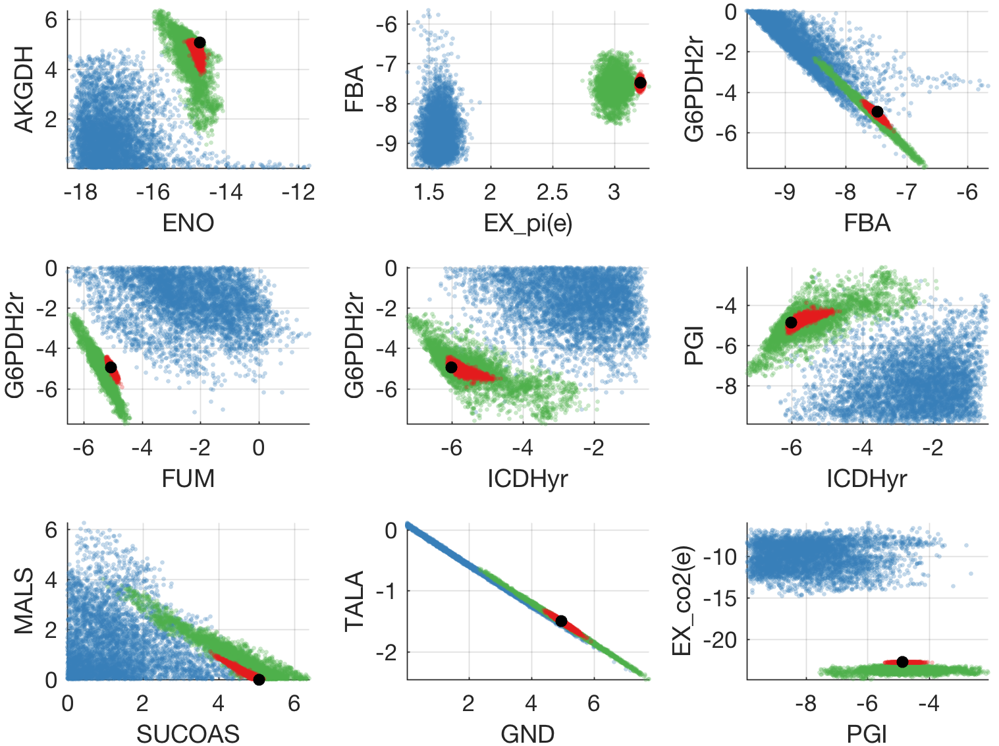

# BaMFA: Bayesian Metabolic Flux Analysis

Bayesian Metabolic Flux Analysis MATLAB package by <a href="https://users.aalto.fi/~heinom10/">Markus Heinonen</a>, Maria Osmala, Henrik Mannerström, Juho Rousu, Samuel Kaski and Harri Lähdesmäki from the <a href="http://research.cs.aalto.fi/csb/">CSB research group</a> of <a href="http://www.aalto.fi/en/">Aalto University</a>.

Constructs a Bayesian metabolic model and samples the flux posterior: all flux vectors that are compatible with steady-state, flux upper and lower bounds and flux measurements. The flux posterior is represented by a set of flux vectors that can be analysed for flux distributions or flux pair distributions. Uses Gibbs sampling to characterise the posterior. 

Genome-scale models are supported, but sampling time can be several hours.

This is a Bayesian drop-in replacement to standard flux balance analysis (FBA), metabolic flux analysis (MFA) and flux variability analyses (FVA).

### Flux distributions

Below is visualised nine example flux pair distributions in three conditions (red/blue/green). The black dot is the classic FBA solution, while the scatter plots indicate all possible flux states (from functions `bfma` and `plotfluxpair2`, See `demo.m`).

<p align="center">
  
</p>


### Package

Requirements:
- MATLAB
- <a href="https://opencobra.github.io/cobratoolbox/stable/">OpenCobra MATLAB toolbox</a>

Main functions:
- `sol = bfba(model,fba)`
  - runs **Bayesian FBA** and returns set of optimal growth flux vectors
- `sol = bmfa(model,meas,errs)`
  - runs **Bayesian MFA** and returns sets of flux vectors compatible with measurements `meas` with errors `errs`
- `plotfluxes(model,sol,fluxinds)`
  - plots univariate flux distributions of fluxes `fluxinds`
- `plotfluxpair2(model,sol,indpairs)`
  - plots bivariate flux pair distributions (see also `plotfluxpair`)


### How to run:

Run `demo.m` in MATLAB or run

```
% run FBA on the ecoli core metabolism (77 reactions)

addpath code;
initCobraToolbox;

% read model
model = readCbModel('models/Ec_core_flux1','fileType','SBML');

% run baseline FBA
fba = optimizeCbModel(model);

% sample, uses by default 10 chains of 200 samples with thinning = 50
sol = bfba(model, fba);

%% visualise

% plot first 15 flux distributions with fba
figure; plotfluxes(model, sol, 1:15, fba);

% plot 7x7 flux pair grid
figure; plotfluxpair(model, sol, [10 2 40 42 45 53 55], fba);

% plot 8 example flux pairs
figure; plotfluxpair2(model, sol, [30 40; 30 41; 40 47; 15 17; 4 5; 1 6; 10 18; 42 45], fba);
```

